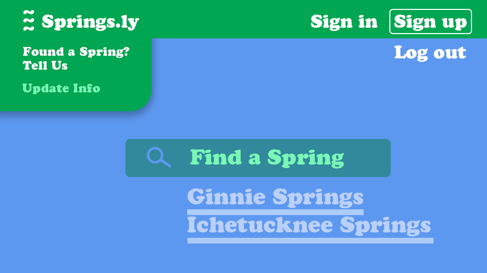
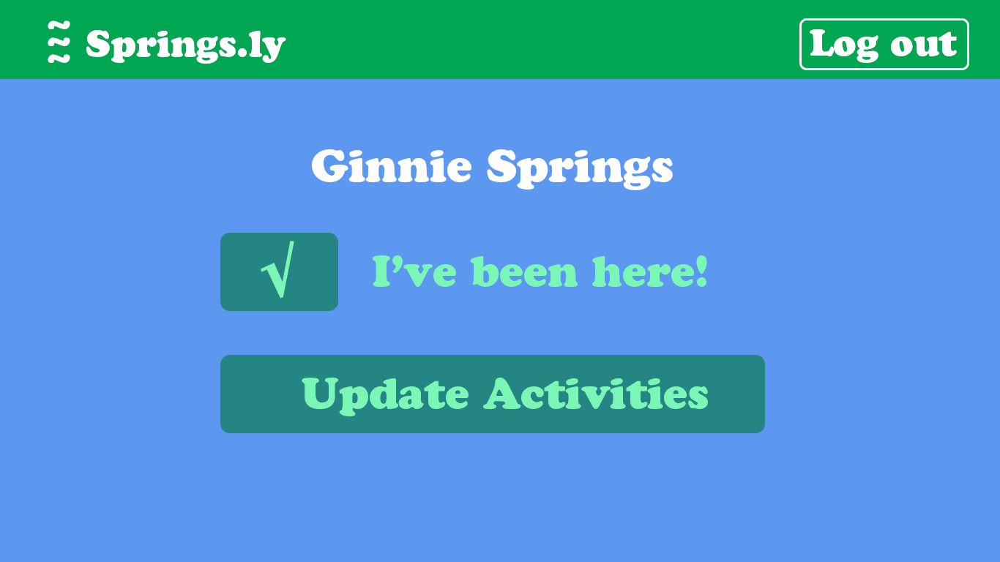

<h1>GA Project 2: Springs.ly</h1>

<h3>Project Goals:</h3>
<p>For my second project, I set out to build a mobile-first app that displayed real-time databases from APIs and could be queried. However, what resulted was  accomplished with a psuedo-Api, whereby I seeded data into a Schema that's stored in a Mongo database. The db serves up arrays of trivia, activities, and a carousel of images. 

The app is built using:

* HTML
* CSS
* JavaScript
* Mongoose / MongoDB
* React Express
* Node.js
* Adobe Photoshop 
* Adobe Fonts

It incorporates the MVC file structure and the 7 RESTful routes and operates at full CRUD.
</p>

<h3>User Stories:</h3>
<p>Users can see an Index of Florida Springs and step into each Spring to see more info about it.
Users have the ability to make New springs or Delete ones they've been to.</p>

> I love to swim in Florida's beautiful springs and I wanted a way to track the springs for any impulsive visit. - Jon

<h3>Wireframes:</h3>

_Mobile Home Page and Scroll_
<br />


_Mobile Show Page_
<br />


_Desktop Home Page_
<br />


_Desktop Scroll_
<br />


_Desktop Show Page_
<br />


_Desktop Edit Page_
<br />



<h4>For Heroku, use engines and the current version of Node.js. Make sure start is specified.</h4>

```json 
{
  "engines": {
    "node": "13.12.0"
  },
  "name": "project_2",
  "version": "1.0.0",
  "description": "",
  "main": "server.js",
  "scripts": {
    "test": "echo \"Error: no test specified\" && exit 1",
    "start": "node server.js",
    "dev": "nodemon"
  },
  "keywords": [],
  "author": "",
  "license": "ISC"
}
```
